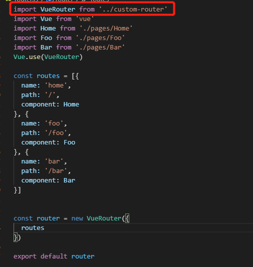

## 前言

​    我们都知道vue-router的两种模式：hash和history，但是内部到底是怎么实现的呢？本次以mode为history模式为例来简单实现vue-rotuer。

## 项目结构

   可以使用vue-cli来生成初始项目，然后使用自定义的router插件，具体是在router配置文件中导入：



## vue-router

1. 首先创建并导出一个VueRouter对象，构造函数中有三个属性：创建路由实例时传入的参数（options）、路由列表（routerMap）、当前路由（data）

```javascript
let _Vue = null

export default class VueRouter {
  constructor (options) {
    this.options = options
    this.routerMap = {} // 路由列表键值对 {path: component}
    this.data = _Vue.observable({ // 当前路由
      current: '/'
    })
  }

}
```

2. 使用路由的时候回调用Vue的use方法，所以需要暴露一个静态的install方法：

   ```javascript
     static install (Vue) {
       // 判断是否已经安装vue-router
       if (VueRouter.install.installed) return
       VueRouter.install.installed = true
   
       // 缓存Vue实例
       _Vue = Vue
   
       // 把创建Vue实例时接收的router对象，混入到每一个Vue实例上
       _Vue.mixin({
         beforeCreate () {
           if (this.$options.router) {
             _Vue.prototype.$router = this.$options.router
             // 对router对象进行初始化
             this.$options.router.init()
           }
         }
       })
     }
   ```

3、对router对象进行初始化的时候主要三件事：

-  遍历路由对象，把路由规则解析成键值对的形式，并存储到routerMap中
- 初始化router-link/router-view等组件
- 处理浏览器向前向后事件加载组件

```javascript
  init () {
    // 遍历路由对象，把路由规则解析成键值对的形式，并存储到routerMap中
    this.createRouterMap()
    // 初始化router-link/router-view等组件
    this.initComonents(_Vue)
    // 处理浏览器向前向后事件加载组件
    this.initEvent()
  }

  createRouterMap () {
    this.options.routes.forEach(route => {
      this.routerMap[route.path] = route.component
    })
  }

  initComonents (Vue) {
    let self = this
    Vue.component('router-link', {
      props: {
        to: String
      },
      render(h) {
        return h('a', {
          attrs: {
            href: this.to
          },
          on: {
            click: this.clickHandler
          }
        }, [this.$slots.default])
      },
      methods: {
        clickHandler (e) {
          e.preventDefault()
          // 改变地址栏的地址
          history.pushState({}, '', this.to)
          this.$router.data.current = this.to
        }
      }
    })
    Vue.component('router-view', {
      render(h) {
        const component = self.routerMap[self.data.current]
        return h(component)
      }
    })
  }

  initEvent () {
    window.addEventListener('popstate', () => {
      this.data.current = window.location?.pathname || '/'
    })
  }
```

完整代码为：

```javascript
let _Vue = null

export default class VueRouter {
  static install (Vue) {
    // 判断是否已经安装vuerouter
    if (VueRouter.install.installed) return
    VueRouter.install.installed = true

    // 缓存Vue实例
    _Vue = Vue

    // 把创建Vue实例是接收的router对象，混入到每一个Vue实例上
    _Vue.mixin({
      beforeCreate () {
        if (this.$options.router) {
          _Vue.prototype.$router = this.$options.router
          this.$options.router.init()
        }
      }
    })
  }

  constructor (options) {
    this.options = options
    this.routerMap = {} // 路由列表键值对 {path: component}
    this.data = _Vue.observable({ // 当前路由
      current: '/'
    })
  }

  init () {
    // 遍历路由对象，把路由规则解析成键值对的形式，并存储到routerMap中
    this.createRouterMap()
    // 初始化router-link/router-view等组件
    this.initComonents(_Vue)
    // 处理浏览器向前向后事件加载组件
    this.initEvent()
  }

  createRouterMap () {
    this.options.routes.forEach(route => {
      this.routerMap[route.path] = route.component
    })
  }

  initComonents (Vue) {
    let self = this
    Vue.component('router-link', {
      props: {
        to: String
      },
      render(h) {
        return h('a', {
          attrs: {
            href: this.to
          },
          on: {
            click: this.clickHandler
          }
        }, [this.$slots.default])
      },
      methods: {
        clickHandler (e) {
          e.preventDefault()
          // 改变地址栏的地址
          history.pushState({}, '', this.to)
          this.$router.data.current = this.to
        }
      }
    })
    Vue.component('router-view', {
      render(h) {
        const component = self.routerMap[self.data.current]
        return h(component)
      }
    })
  }

  initEvent () {
    window.addEventListener('popstate', () => {
      this.data.current = window.location?.pathname || '/'
    })
  }
}

```


具体项目结构请看： https://github.com/zjiedo/custom-vue-router