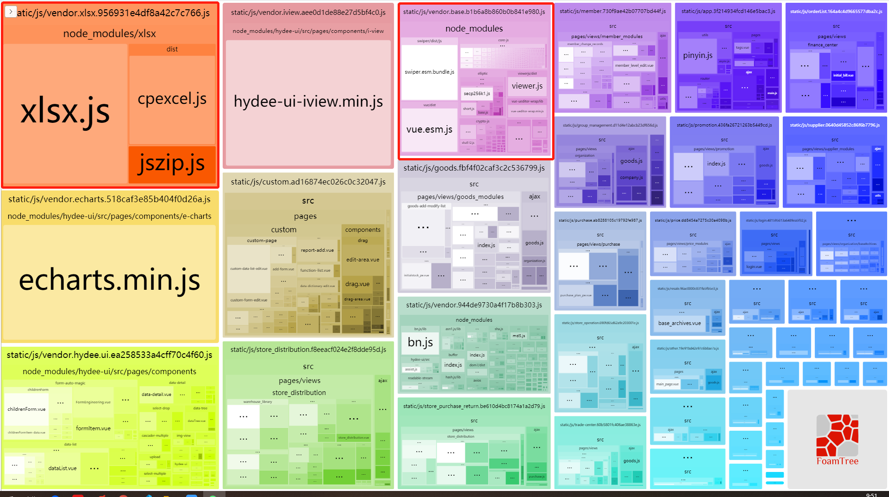
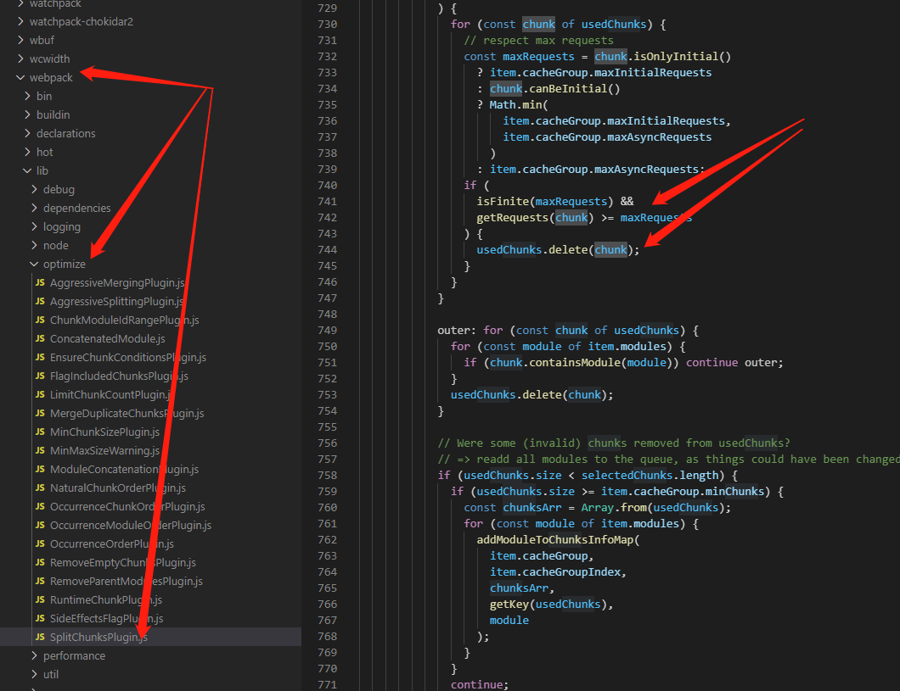
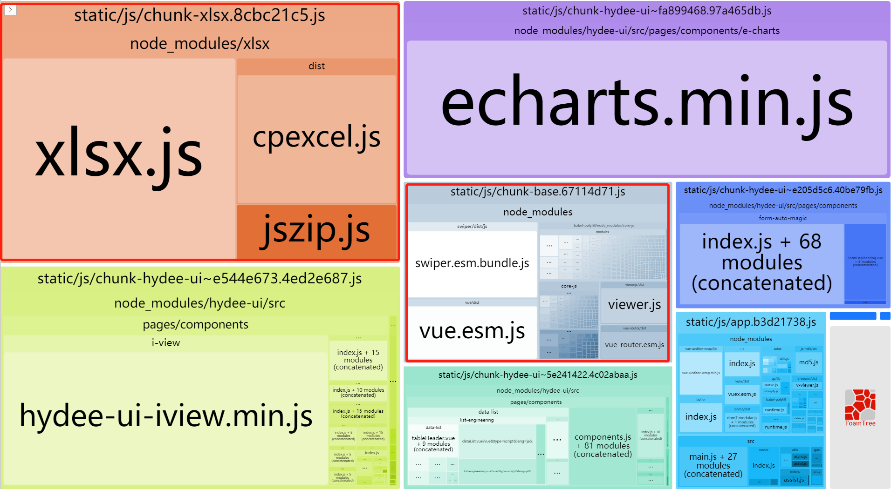

##### 前言
  数星期之前，领导让我把webpack3升级一下。因为公司用的框架是vue， 所以我直接换了vue-cli4，因为这个实在简单多了，一步到位比较好。

###### webpack3配置代码拆分

  因为原来项目用了为了缓存改变不常改变的包， 用了webpack.optimize.CommonsChunkPlugin，并且定义了如下配置：
  ```javascript
   // xlsx
    new webpack.optimize.CommonsChunkPlugin({
      name: 'vendor.xlsx',
      minChunks(module) {
        return (
          module.resource &&
          /\.js|.vue$/.test(module.resource) &&
          module.resource.indexOf(
            path.join(__dirname, '../node_modules/xlsx')
          ) === 0 || module.resource.indexOf(
            path.join(__dirname, '../node_modules/swiper')
          ) === 0 || module.resource.indexOf(
            path.join(__dirname, '../node_modules/vue')
          ) === 0 || module.resource.indexOf(
            path.join(__dirname, '../node_modules/vue-router')
          ) === 0 || module.resource.indexOf(
            path.join(__dirname, '../node_modules/core-js')
          ) === 0 || module.resource.indexOf(
            path.join(__dirname, '../node_modules/elliptic')
          ) === 0 || module.resource.indexOf(
            path.join(__dirname, '../node_modules/crypto-js')
          ) === 0 || module.resource.indexOf(
            path.join(__dirname, '../node_modules/viewerjs')
          ) === 0 
        )
      }
    }),
    // base
    new webpack.optimize.CommonsChunkPlugin({
      name: 'vendor.base',
      minChunks(module) {
        return (
          module.resource &&
          /\.js|.vue$/.test(module.resource) &&
          module.resource.indexOf(
            path.join(__dirname, '../node_modules/swiper')
          ) === 0 || module.resource.indexOf(
            path.join(__dirname, '../node_modules/vue')
          ) === 0 || module.resource.indexOf(
            path.join(__dirname, '../node_modules/vue-router')
          ) === 0 || module.resource.indexOf(
            path.join(__dirname, '../node_modules/core-js')
          ) === 0 || module.resource.indexOf(
            path.join(__dirname, '../node_modules/elliptic')
          ) === 0 || module.resource.indexOf(
            path.join(__dirname, '../node_modules/crypto-js')
          ) === 0 || module.resource.indexOf(
            path.join(__dirname, '../node_modules/viewerjs')
          ) === 0 
        )
      }
    }),
  ```
  - 配置之后代码会根据规则打包，生成的文件包含vendor.xlsx和vendor.base两个文件

  

###### webpack4配置代码拆分
- 在vue.config.js中配置
```
 config.optimization.splitChunks({
    chunks: 'all', // async表示抽取异步模块，all表示对所有模块生效，initial表示对同步模块生效
    minSize: 0,
    cacheGroups: {
      base: {
        test: /[\\/]node_modules[\\/](swiper|vue|vue-router|core-js|elliptic|viewerjs)[\\/]/,
        name: 'chunk-base',
        chunks: 'initial',
        priority: 40
      },
      xlsx: {
        name: "chunk-xlsx",
        test: /[\\/]node_modules[\\/]xlsx[\\/]/,
        chunks: 'initial',
        priority: 30
      },
    }
  })
```
- 但是如上配置之后并不会同时生成chunk-base和chunk-xlsx，谁的priority数值大会生成谁，也就是说不能并存。
- 我也不知道为啥， 多方查找询问，无果。遂查看webpack的源码

  

- 与chunk-base 的chunk相比，chunk-xlsx的getRequests(chunk)的值大了 ‘1’， 然后我往xlsx的配置中加了maxInitialRequests参数，就好了：
  ```
    maxInitialRequests: 4
  ```
- 打包的结果如下：
  
- 所以我们来说说maxInitialRequests参数吧！

##### maxInitialRequests

​	这个参数表示：入口点的最大并行请求数，默认值为3。之所以有这个配置也是为了对拆分数量进行限制，不至于拆分出太多模块导致请求数量过多而得不偿失。

- 如果同时有两个模块满足cacheGroup的规则要进行拆分，但是maxInitialRequests的值只能允许再拆分一个模块，那尺寸更大的模块会被拆分出来。

##### 有点难，过几天再理解

 